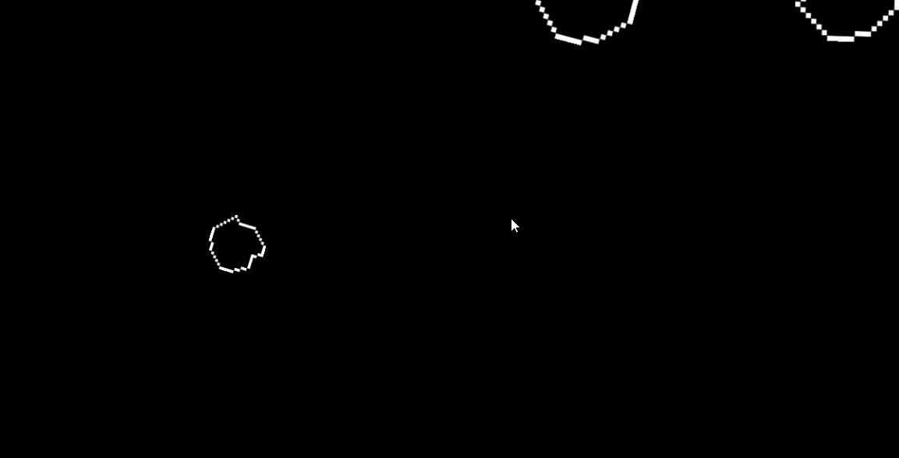

# 🚀 Space Rocks

Um jogo clássico no estilo **Asteroids**, desenvolvido no **GameMaker Studio 2** 🎮  
O objetivo é **destruir os meteoros** e **sobreviver o máximo de tempo possível!**

---

## 🎥 Demonstração

---

## 🧩 Sobre o projeto

O **Space Rocks** foi criado para praticar lógica de programação e o uso da **linguagem GML (GameMaker Language)**.  
O jogo utiliza **instâncias, colisões, variáveis globais** e um **sistema de pontuação simples**.

### 🪐 Principais elementos:
- **Nave controlável:** se movimenta e atira em qualquer direção  
- **Meteoros (rocks):** aparecem em tamanhos variados e se dividem quando destruídos  
- **Projéteis (bullets):** disparam na direção da nave  
- **Pontuação:** aumenta ao destruir meteoros  
- **Sistema de física simples:** movimentação contínua e rotação  
